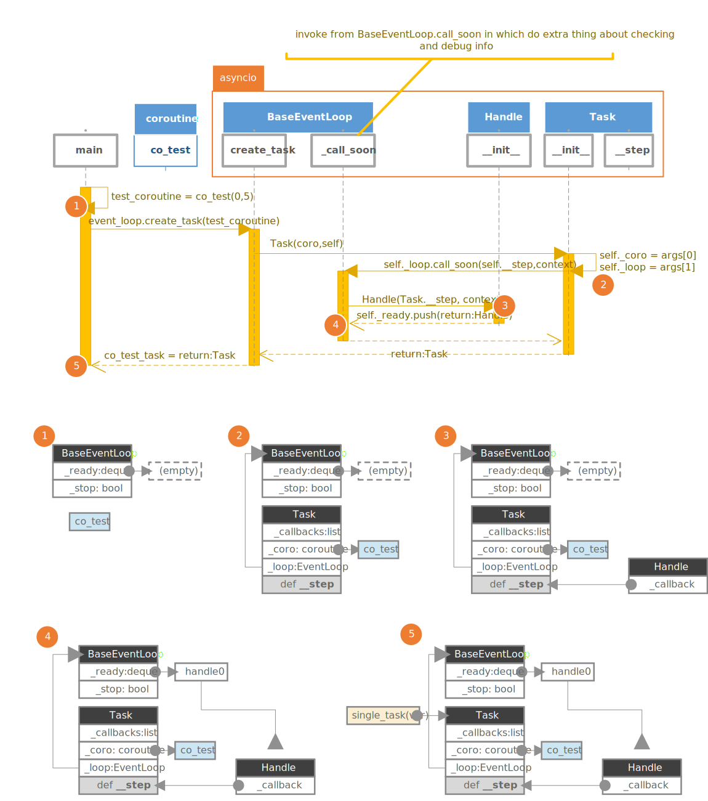
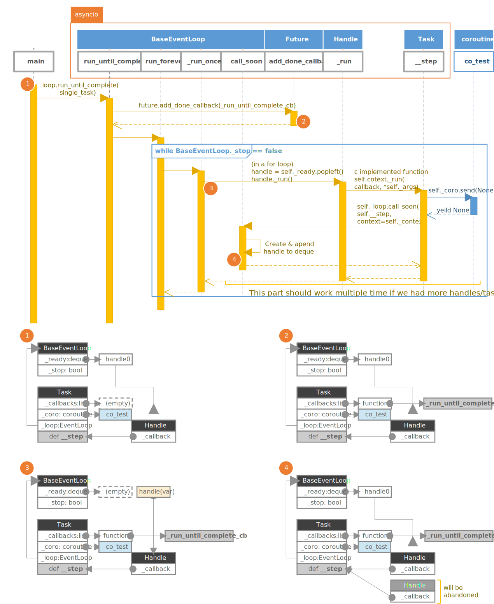
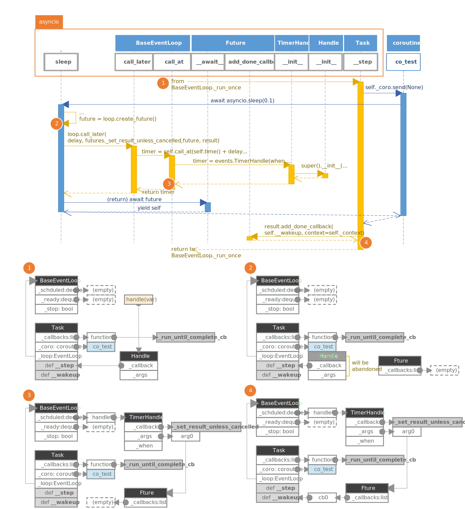
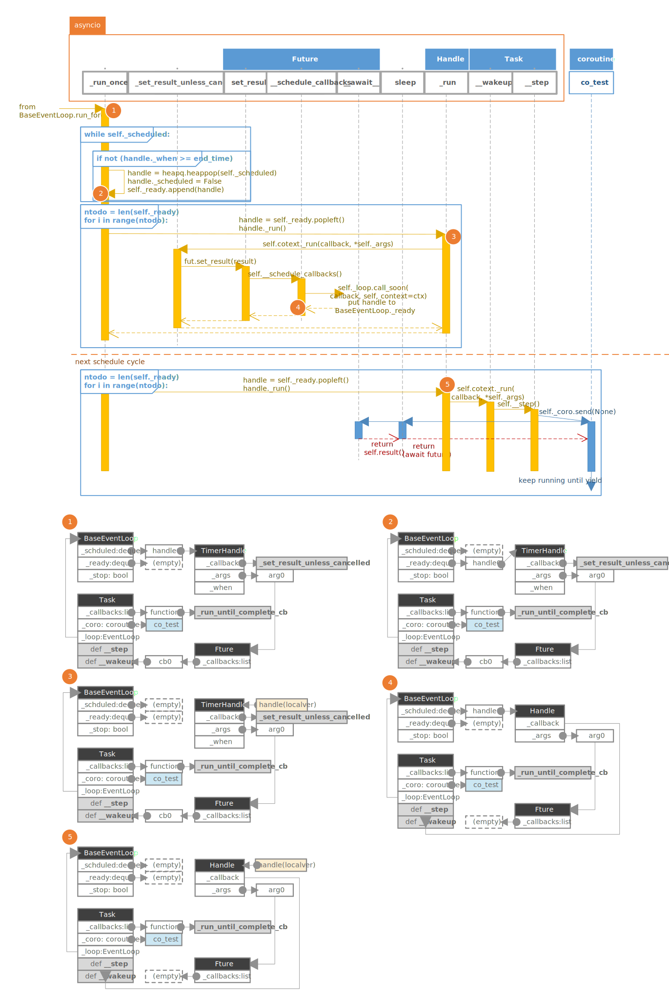
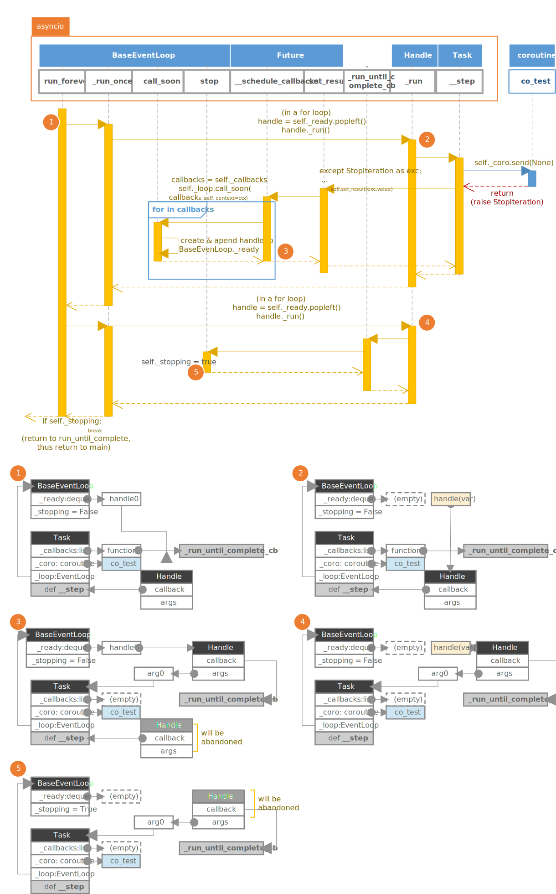

# Python Coroutine Explain
- [Python Coroutine Explain](#python-coroutine-explain)
- [Introduction](#introduction)
- [SIDENODE: My Thought at Before](#sidenode-my-thought-at-before)
- [Table of Contents](#table-of-contents)
- [Before the Explain](#before-the-explain)
  - [Coroutine](#coroutine)
    - [Why coroutine](#why-coroutine)
    - [Detail in coroutine/thread](#detail-in-coroutinethread)
    - [Generator/Coroutine](#generatorcoroutine)
      - [What is generator](#what-is-generator)
      - [Why suddenly generator](#why-suddenly-generator)
      - [Capture return value of Generator](#capture-return-value-of-generator)
      - [Sub-generator](#sub-generator)
      - [Generator to coroutine](#generator-to-coroutine)
      - [manipulate the coroutine](#manipulate-the-coroutine)
  - [EventLoop](#eventloop)
    - [Why EventLoop](#why-eventloop)
    - [How does it works](#how-does-it-works)
    - [Implemetation in python](#implemetation-in-python)
      - [Handle/TimerHandle](#handletimerhandle)
      - [BaseEventLoop](#baseeventloop)
      - [add normal callback: BaseEventLoop.call_soon](#add-normal-callback-baseeventloopcall_soon)
      - [add timer callback: BaseEventLoop.call_later](#add-timer-callback-baseeventloopcall_later)
      - [enter the loop: BaseEventLoop.run_forever](#enter-the-loop-baseeventlooprun_forever)
      - [process all callbacks: BaseEventLoop._run_once](#process-all-callbacks-baseeventloop_run_once)
    - [How does it work](#how-does-it-work)
    - [Implementation in Python](#implementation-in-python)
      - [important members](#important-members)
      - [I'm done : `Future.set_result`](#im-done--futureset_result)
      - [add observer to "I'm done"  : `Future.add_done_callback`](#add-observer-to-im-done---futureadd_done_callback)
      - [tell others that I'm done : `Future.__schedule_callbacks`](#tell-others-that-im-done--future__schedule_callbacks)
      - [make it awaitable: `Future.__await__`](#make-it-awaitable-future__await__)
  - [Task](#task)
    - [Why Task](#why-task)
    - [Implementation in Python](#implementation-in-python-1)
      - [important members](#important-members-1)
      - [Core of handle running/waiting: `Task.__step`:](#core-of-handle-runningwaiting-task__step)
        - [run its "time slice"](#run-its-time-slice)
        - [wait `Future`](#wait-future)
        - [handle cancel request](#handle-cancel-request)
      - [request cancel: `Task.cancel`](#request-cancel-taskcancel)
      - [wake up coroutine: `Task.__wakeup`](#wake-up-coroutine-task__wakeup)
      - [create a coroutine "thread": `Task.__init__`](#create-a-coroutine-thread-task__init__)
  - [Put it together](#put-it-together)
    - [Review and concentration](#review-and-concentration)
    - [Diagrams of transformation between functions](#diagrams-of-transformation-between-functions)
      - [create a Task](#create-a-task)
      - [running normally](#running-normally)
      - [yield Future](#yield-future)
      - [wakeup from Future](#wakeup-from-future)
      - [exit loop](#exit-loop)
# Introduction
When you wanna do several tasks simultaneously in a single  program, multi-threading has been a mature choice, not only does it give you that all treads are seemingly running at the same time, it also can utilize the multi-core system. 

But in these years, an emerging terminology "coroutine" jumped into my view. Coroutine is called "light-weight thread". Indeed, they have resembles, in our user's perspective of which we work with higher level interface, they all can give us the ability/illusion of doing different things in the same time, and the underlying mechanism are basically same:
  -  running a thread/coroutine for a small slice of time (or work), then pause it.
  - having a scheduler to decide which thread/coroutine to run next.
  
 So what makes coroutine different? And why we even need to use coroutine? Compare to the multi-threading, how `asyncio`  make coroutine running concurrently?
 
 These questions are what this article is gonna explore.
 <!-- It turns out that coroutine has performance advantage over the following major difference when compare to the multiple threading:
    
  - coroutine pause itself by explicit code, but thread is passively paused by timer interrupt(although you can actively pause too).

This gives the coroutine the low overhead over the scheduler switching the routine. With these being said, here a some question that you might be interested:
  - how can coroutine has low overhead compare to multiple thread?
  - where is the "scheduler" for coroutine?
  - how does the coroutine's "scheduler" work? -->


# SIDENODE: My Thought at Before
I've been using coroutine in python for several times, the interface of `asyncio` are not hard to understand and handy to use, but it's still kind of mysterious.

It seems to me that, when you add `async` to a function , then it becomes a coroutine, when you wanna get a return value from a `async` function(or coroutine), you need to add `await` in front of the call. If you wanna stop the current job and give other coroutines the opportunity to execute, you might insert an `async.sleep()` in a suitable place. 

But when you wanna run some sub coroutine concurrently, you should use `await asyncio.gather(sub_coroutine0, sub_coroutine1,...)`, or the following code can do it too:

``` python
    sub_task0 = asyncio.create_task(sub_coroutine0)
    sub_task1 = asyncio.create_task(sub_coroutine1)
    # more sub tasks
    await sub_task0
    await sub_task1
    # wait more sub tasks
```
I mean, what makes `asyncio.gather`/`asyncio.create_task` different from code below?
``` python 
    await sub_coroutine0
    await sub_coroutine0
```


When it comes to executing, we need to use `async.run`, so what does it do to the coroutine object so that it could execute those code concurrently?

Finally, what is the `Task`? why we can cancel a coroutine and get the result through it? It's a normal class rather than a coroutine, why we can also apply `await` to a Future object? 
<!-- How does it cooperate with coroutine and event loop?  -->

<!-- I think I have asked too much qeustions, wheather it's simple or not to figure out based on current knowlage storage, let's just start to exploration. 

  *You might wanna see the `coroutine` first.* -->
# Table of Contents

#  Before the Explain
In Python we got new keyword/classes/feature for coroutine, and sure, we can explain it by reading and analyzing the code, but I think it's a good thing to start from "why we need these classes/feature, what does these things contribute to our purposes?". These things are not taken for granted, they didn't jump out from nowhere, there must be some reasons for such design.

With the consideration of how multiple threads works, here are an overview about roles of each major part:
  - coroutine: feature of Python(usually `async` function). In multithreading we are pausing and resuming normal functions. But as I mentioned before, coroutine has different underlying mechanism, so get coroutine to serve this purpose.
  - BaseEventLoop: a major class that acts as an Scheduler, have several inherited class to implement events associated part. Multithreading need a scheduler to decide which thread to continue at next time slice. It not only needs run "coroutine threads" unconditionally, it also can associate "coroutine threads" with event such as IO, timer.
  - Future:  a class that allow you operate data between different "coroutine threads"
  - Task: a class the provide an abstraction as the "coroutine threads"
  - await: keyword to help you manage the resuming/pausing of coroutine call chain.

 we are gonna inspect them one by one and get an idea of what they are doing in detail. Keyword `await` is different, although the most fundamental thing they do is same, but it has different "pre-processing logic" when applied to different object, so it's scattered across these explanations. 

Then at section [Put it together](#put-it-together),  we'll see how these things work together to make coroutine version of "multiple threads" cooperation possible.

## Coroutine

### Why coroutine
Just like thread, the coroutine is who can be paused and resumed. But comparing to the multithreading, which has some overhead and troublesome thing you need to deal with: 

  1. Critical area and race condition, which involves synchronization of communicating data across threads. in addition to deal troublesome synchronization problem,  here is inevitable extra overhead.
  2. Context switch. to switch a thread -- interrupt by timer(or sleep obediently), storing current context, scheduler's decision, switching stack of another thread, restoring the context --these also has overhead.
  3. various hardware caches problems.

The coroutine can achieve better performance in its own special way. Instead of switching tasks by timer interrupt at an unpredictable execution point, coroutine allows you to "hang up" the current "coroutine thread“ actively by explicit code, so here is:
 - no way for other task interrupt your critical operation in the  middle.
 - no necessity of "switching context", because the task knows what it should save before it giving up the execution. 
<!-- ### Some conecpt before coroutine
when we talk about coroutine, what do we refer to? do we talk about a block of specific code? 

think about thread, when we talk about it, it should be some thing " I can run a function in another thread?"
    Execution: when you invoke a function, you can say I start to  execute the a function, when you get return value from the function, you can say that the excution of the function is stopped. So execution refer to the process of the function. 
    
    Function: function is just code
    State:

Use an analogy of making cake with a cookbook: 
- The text in the cookbook that tells you how to get a cake is **function**, it's describes that through what steps what result you will get. but it still need you(CPU) to execute it.

- The whole process of doing this is like **execution**. at the begin of doing this,  you can say it as I started **making** cake ,you can say I'm **making**  at the middle, or I ended **making** cake.
- At anytime of you making the cake, you can call it state. -->
### Detail in coroutine/thread
From the view of C++, normal function usually  has its local variables stored in its own frame on the stack, when return from it, the frame is released from the stack. 

When we say the thread, we also consider it as running instructions at a seemingly individual execution environment, this includes the stack(pointed by RSP), general register(RAX, RBX, etc.), and PC(in RIP), when we switch to a different thread, we need to save/ restore these register context too. 


But for coroutine, things are different. Coroutine is not a traditional function, it has its own frame outside the stack, and it grasps the intuitive to pause. so we don't care about register things,  coroutine could by itself stores only needed contents to memory before pause. 

Here is what basically coroutine need:
- allocating an chuck of memory as the exclusive frame for the function.
- only destroying it when we don't need it anymore(final return).
- having explicit code to pause(return in the middle) and get registered variables/PC back to its own frame.


Although thing are not exactly the same in python -- at least we don't consider the register things -- but the fundamental idea is same: to have its own frame and  the frame is alive even if we exit from it.

But notice, **here is a major difference between coroutine and thread have:** Each thread has its execution environment, from the view of stack,  it's embodied in that each thread has it's own stack for the function call chain. When we talk about running multiple coroutines, it usually refers to running them in single thread(but we can do things like pausing a coroutine in one thread and resume it in another thread), so here is only one stack for one function call chain.


<!-- 
### try to write a resumable function in plain Python code
For local variables, we can use an pure data class, it responsible for store all local variables and will be passed it as an argument for our function, so the data the function wanna know after resuming is in this argument. 

To provide more friendly interface, we can create a class that contain some intuitive methods:
 - `resume` : resume the execution of the function.
  - `result` : get final result. 

In addition to that, with the ability of class we also can include local variables as class members. what I imagined is like this:
``` python
class Resumable:
    def __init__(self, arg0, arg1):
        #self._arg0 = arg0
        #self._arg1 = arg1
        pass

    # To check whether this Resumable reach the end of execution,
    # this is gonna return a `bool`.
    def resume(self)->bool:
        pass

    def result(self):
        pass
```


``` python
def example(start, end):
    result = 0
    while start < end:
        result += start
        start += 1
        # PAUSE
        print("resumed")
    return result
```


``` python
def my_sum(start, end):
    result = 0
    while start < end:
        result += start
        start += 1
        # PAUSE
        print("resumed")
    return result
```

for simplicity, now just implement function that sum all integer within a range [start, end), like this:
I will create a function `my_range_v0` that completely use the variables in an object of `LocalVar` class, it won't done all while at once but do one small step then go back, we can get result by resuming it multiple time. 

To give the control back to caller, the "pausing" is just a `return`. To distinguish the final return from intermediate pausing, what I choose is to return a `bool` value. For the real return value, we need a place to store it and user can retrieve it when our function is done, I think put it in the `LocalVar` is good. 

Tto enter our resumable function, "Resuming" is just calling the function again. And don't forget to pass the local variables to the function:

``` python
class LocalVarV0: # pretend that it's a pure data structure
    def __init__(self, start, end):
        self.result = 0
        self.start = start
        self.end = end

def my_sum_v0(local_var:LocalVarV0):
    while local_var.start < local_var.end:
        local_var.result += local_var.start
        local_var.start += 1
        return True
    return False
        
local_var = LocalVarV0(0, 5)

i = 0
while my_sum_v0(local_var):
    i += 1
    print(f"doing another thing for {i} time(s)")

print("result is", local_var.result)
```
``` 
[output]:doing another thing for 1 time(s)
doing another thing for 2 time(s)
doing another thing for 3 time(s)
doing another thing for 4 time(s)
doing another thing for 5 time(s)
result is 10
```
That seems work, `my_sum_v0` is using the variable `local_var`, which can record any data operation in the `my_sum_v0`， thus the function can know which step it went to.
But soon we can come up with some questions:
 1. The interface looks like a normal function, not very intuitive when you first time see it.
 2. Now it only have one pause point and that point at the end of the `while` block, so call it again will enter the "natural resume point", we need to come up an idea to deal with multiple pause points in different position, for example:
    ```python 
    def my_sum1(start, end):
        result = 0
        i = 0
        # PAUSE
        print(f"resume from first pause")
        while start < end:
            result += start
            start += 1
            # PAUSE
            print(f"resume {i} time(s)")
            i += 1
        return result
    ```

### solve problem 1: more intuitive interface
To provide more friendly interface, we can pack it into a class and provide some intuitive methods. And with class, we also can include local variables as class members data.

Here I have `resume` methods that basically do same thing as it did. and you can get return value by calling method `result`.

``` python
class my_sum_v1: # pretend that it's a pure data structure
    def __init__(self, start, end):
        self._result = 0
        self._start = start
        self._end = end

    def resume(self):
        while self._start < self._end:
            self._result += self._start
            self._start += 1
            return True
        return False
    
    def result(self):
        return self._result

i = 0
resumable = my_sum_v1(0, 5)
while resumable.resume():
    i += 1
    print(f"doing another thing for {i} time(s)")
print(f"result is", resumable.result())
```
```
[output]:doing another thing for 1 time(s)
doing another thing for 2 time(s)
doing another thing for 3 time(s)
doing another thing for 4 time(s)
doing another thing for 5 time(s)
result is 10
```
### solve problem 2: record where it left
Okay Okay, to implement more complicated function,  we definitely need more work, for example:
``` python
def my_sum_template(local_var):
    if local_var.start < local_var.end:
        local_var.result += local_var.start
        # PAUSE
        local_var.start += 1
        # PAUSE
    else:
        return local_var.result
```
To do that, we can add `if` + individual tag before where we wanna resume.  I'll try to add an extra variable `state` in `local_var` to  record such tag so that it'll know where to continue at next time. And to indicate the itermidiate return, I'll use an distinct object and return it:

``` python
# this will work fine(MAYBE?)
class LocalVarV1: 
    STATE_ADD_ORIGINAL = 1
    STATE_INCREASE = 2
    INTERMEDIATE_RETURN = object()
    def __init__(self, start, end):
        self.result = 0
        self.start = start
        self.end = end
        self.state = self.STATE_ADD_ORIGINAL

def my_sum_v1(local_var:LocalVarV1):
    if local_var.start < local_var.end:
        # RESUME point 1
        if local_var.state == local_var.STATE_ADD_ORIGINAL:
            local_var.result += local_var.start
            local_var.state = local_var.STATE_INCREASE
            return local_var.INTERMEDIATE_RETURN
        # RESUME point 0
        elif local_var.state == local_var.STATE_INCREASE:
            local_var.start += 1
            local_var.state = local_var.STATE_ADD_ORIGINAL
            return local_var.INTERMEDIATE_RETURN
        # I hope I can put RESUME point 1 at here
        # but it won't work
    else:
        return local_var.result
        
local_var = LocalVarV1(0, 5)
i = 0
while True:
    ret = my_sum_v1(local_var)
    print(f"doing another thing for {i} time(s)")
    if ret is not local_var.INTERMEDIATE_RETURN:
        print(f"result is {ret}")
        break
    i+=1

```
``` 
[output]:doing another thing for 0 time(s)
doing another thing for 1 time(s)
doing another thing for 2 time(s)
doing another thing for 3 time(s)
doing another thing for 4 time(s)
doing another thing for 5 time(s)
doing another thing for 6 time(s)
doing another thing for 7 time(s)
doing another thing for 8 time(s)
doing another thing for 9 time(s)
doing another thing for 10 time(s)
result is 10
```
it seems works just as I expected, REALLY? actually not, here is just some gimmick, if you look it carefully you'll realize that it doesn't really resume from where it left. so if we use same trick for the code below, it'll failed:

``` python
def my_sum_v2(local_var:LocalVarV1):
    if local_var.start < local_var.end:
            local_var.result += local_var.start
            # RETURN AS PAUSE
            local_var.start += 1
            local_var.start = local_var.end
            # RETURN AS PAUSE
            print("please print me")
    else:
        return local_var.result
```
 - That interface is vague, can I make it more user friendly?
 -->

### Generator/Coroutine
#### What is generator
Generator was meant to be a powerful iterator,  you can define something looks like an normal function, but you can insert the keyword `yield` you to return an intermediate result (“the next value”) to its caller,  but maintaining the function’s local state so that the function can be resumed again right where it left off. 

Here a simple example to get an integer sequence from 0 to a given number:
```python 
def seq(end): 
    i = 0
    while i < end:
        yield i
        i+=1

for i in seq(10):
    print(i, end = ' ')
```
```
[output]:0 1 2 3 4 5 6 7 8 9 
```
If you just wanna get "next value" of generator, use `next` method:
```python 
s = seq(10)
print(next(s), end = ' ')
print(next(s), end = ' ')
next(s)
```
```
[output]:0 1
```
#### Why suddenly generator
Through the example above and by intuitive, that give us the sense that the `next` is what resume generator, the `yield` is what pause generator.

For more detail of what that is, we can look at document:
> Generator is a function that returns a **generator iterator**. It looks like a normal function except that it contains yield expressions for producing a series of values usable in a for-loop or that can be retrieved one at a time with the next() function.
>
> **Generator iterator** is An object created by a generator function. Each yield temporarily suspends processing, remembering the location execution state (including local variables and pending try-statements). When the generator iterator resumes, it picks up where it left off (in contrast to functions which start fresh on every invocation).

Isn't it what we sought? and it's with an extra feature : return a value in the middle by `yield`.


#### Capture return value of Generator
although its has such ability, what we want is still a special "function", so at most of the time we'd like to care about whether the generator is done and what the final result of it. 

 the `return` is still available in the generator and we can use it return a final result. When it reaches `return` in the generator, it'll raise a `StopIteration` and the return value is stored in that exception object. 


To show that, I'm going to apply `next()` to generator iterator to get each `yield` value, and we'll be able to capture that exception:
``` python
def seq_with_return(end):    
    i = 0
    while i < end:
        yield i
        i+=1
    return "done"
try:
    gi = seq_with_return(10)
    while True:
        print(next(gi),end = ' ')
except StopIteration as e:
    print('\n',e.value)
```
```
[output]:0 1 2 3 4 5 6 7 8 9 
 done
```
#### Sub-generator
It's natural to consider of use one generator in another generator. 

From the aspect of iterator, we might  re-yield what sub generator iterator yield(or do modification then re-yield).

From the aspect of pauseable resumable function, we wanna deem them as single whole function, we don't care how deep or complex the call chain of the generator iterator, just here somewhere has `yield`, then it means it require to pause now. 


Whatever, the goal is to propagate the most inner `yield` to the most outer one, and pass the `next`  from the most outer one to the most inner one. The idea is to figure out how to handle `yield` and `next` between one generator iterator and one sub generator iterator, once this is done, it's just the same pattern for other calls in call chain. You might come up with such code: 
```python
def parent_generator():
    ret_of_sub_generator = 0
    try:
        gi = sub_generator()
        while True:
            yield next(gi)
    except StopIteration as e:
        ret_of_sub_generator = e.value
```
This can works fine, even if you want a `parent_parent_generator` or `sub_sub_generator`, just write code with same pattern. But the premise is only if here is no exceptions and our requirement is only processing the intermediate yield point in the sub generator. But to handle all situation, you'll need a very complicated code. you can see it in [PEP 380](https://peps.python.org/pep-0380/#formal-semantics).

So also in [PEP 380](https://peps.python.org/pep-0380/#formal-semantics), here is a keyword `yield from` that you can apply to a sub generator, it help you simplify the code of processing intermediate yield from sub generator, getting return value from sub generator, and handling all corner cases,  here is an example of using `yield from`: 
``` python
def seq_with_return(end):    
    i = 0
    while i < end:
        yield i
        i+=1
    return "done"

def wrapper(end):    
        yield "start of sub_generator\n"
        ret = yield from seq_with_return(end)
        yield "\nend of sub generator"
        yield f"\nsub generator returns: {ret}|"
for value in wrapper(10):
    print(value,end=' ')
```
```
[output]:start of sub_generator
 0 1 2 3 4 5 6 7 8 9 
end of sub generator 
sub generator returns: done 
```
 For simplicity, we can just imagine `yield from` build a transparent channel from parent generator to sub generator so that every operation in the parent generator will be applied in sub generator.

#### Generator to coroutine
In the exploration above, it seems generator is literally a coroutine. actually the generator are enhanced in [PEP 342](https://peps.python.org/pep-0342/) thus it becomes more useful in the scenario of the coroutine. We use generator as coroutine at before(or now).

As we have a coroutine as native language features, it still highly relates to the generator. Actually in [PEP 492](https://peps.python.org/pep-0492/#coroutine-object-methods) it mentions that coroutines are based on generators internally, thus they share the underlying implementation. To make them the distinct concepts,  here are deliberately made differences.


They have pretty similar attributes when you use `dir()` to check their attributes:
``` python
import asyncio
def seq_generator():    
    yield
    pass

async def test_coroutine():
    await asyncio.sleep(0)
    pass

print(dir(seq_generator()))
print(dir(test_coroutine()))
```
```
['__class__', '__del__', '__delattr__', '__dir__', '__doc__', '__eq__', '__format__', '__ge__', '__getattribute__', '__gt__', '__hash__', '__init__', '__init_subclass__', '__iter__', '__le__', '__lt__', '__name__', '__ne__', '__new__', '__next__', '__qualname__', '__reduce__', '__reduce_ex__', '__repr__', '__setattr__', '__sizeof__', '__str__', '__subclasshook__', 'close', 'gi_code', 'gi_frame', 'gi_running', 'gi_yieldfrom', 'send', 'throw']
['__await__', '__class__', '__del__', '__delattr__', '__dir__', '__doc__', '__eq__', '__format__', '__ge__', '__getattribute__', '__gt__', '__hash__', '__init__', '__init_subclass__', '__le__', '__lt__', '__name__', '__ne__', '__new__', '__qualname__', '__reduce__', '__reduce_ex__', '__repr__', '__setattr__', '__sizeof__', '__str__', '__subclasshook__', 'close', 'cr_await', 'cr_code', 'cr_frame', 'cr_origin', 'cr_running', 'send', 'throw']
```

But as we can see, coroutines is indicated  by `async`, and to wait a sub coroutine is not the same keyword `yield form` as in waiting sub-generator. it's `await`.
#### manipulate the coroutine
See through the attribute of coroutine object and generator iterator object,  you'll find coroutine  ***doesn't*** have `__next__` and `__iter__`, but it has more powerful method  `send` same as generator, which is also part of [PEP 342 -  Coroutines via Enhanced Generators](https://peps.python.org/pep-0342/#new-generator-method-send-value) .

In short, calling `send(None)` it's exactly equivalent to calling a generator’s `next()` method, that's what we  only need to know to resume a coroutine. 


Then, how to pause a coroutine? notice that here is another limitation:
> It is a **SyntaxError** to have yield or yield from expressions in an async function.


solution is adding decorator [types.coroutine()](https://peps.python.org/pep-0492/#types-coroutine) in your async function(or define a class with magic method `__await__`, the you can use yield in `__await__`).
As you might guess, the function `types.coroutine()` applies `CO_ITERABLE_COROUTINE` flag to generator-function’s code object, making it return a coroutine object. 

that's what the key code in `types.coroutine()`:
``` python 
def coroutine(func):
    #...
    if (func.__class__ is FunctionType and
        getattr(func, '__code__', None).__class__ is CodeType):
        # ...
        # ...
        if co_flags & 0x20:
            co = func.__code__
            # 0x100 == CO_ITERABLE_COROUTINE
            func.__code__ = co.replace(co_flags=co.co_flags | 0x100)
            return func
    # ...
```
Finally we get new keyword `await` to instead of `yield from`.

Here is an example of print integer sequence from 0 to a given number, but using coroutine with `send` , `await`, `yield`:
``` python
import types
@types.coroutine
def pause(value):    
        yield value

async def seq_coro(end):    
    for i in range(end):
        await pause(i)
try:
    t = seq_coro(5)
    while True:
       r = t.send(None)
       print("yielded:", r)
except StopIteration:
    print("end")

```
```
[out]:yielded: 0
yielded: 1
yielded: 2
yielded: 3
yielded: 4
end
```
## EventLoop

### Why EventLoop
Since we get a coroutine that can be paused and resumed as we wish, the another important thing is to have a something that can help us to manage the running of these coroutines, at least that coroutines can run in an interleaved manner (like running multiple thread in one core).

And as the name "EventLoop" suggests, it should also be able to associate execution of coroutines with particular event. such as:
  - pause for specified amount of time, and resume when timeout.
  - pause to wait for some resource(usually network), and resume when resource is available.
### How does it works
 Surprisingly, the core mechanism of EventLoop in `asyncio` are not necessarily require the feature await/async or coroutine, it's callback based. What you can do with it is adding the callback function in it, which can either be associated  with:
   - IO file object(network etc.), so that corresponding callback will be invoked if read/write is available.
   - some amount of delay.
   - just call it unconditionally.
   

 
 EventLoop internally uses a for loop to call all possible callbacks forever if here is no signal of stopping, At each loop cycle, it uses some  API(usually selector) to determine if here are any IO related callback available,  check the if any time related callback available, then pick out all available callback to execute. But here is a point need to notice: **execpt for the callbacks that relates to events, all callbacks will only be called once.** 

Because IO file associated callbacks are more sensible with code of actually reading/writing, and it's provide higher level interface to use, it's a bit complicated. So we are going to just look at how normaltime related callbacks are added/called in even loop. 
 

### Implemetation in python
#### Handle/TimerHandle
`Handle` and `TimerHandle` are thin wrapper class of callback, the key function `_run` calls a [C-implemented](https://github.com/python/cpython/blob/836b17c9c3ea313e400e58a75f52b63f96e498bb/Python/context.c#L658) function to invoke the callback, you can deem it as `self._callback(*self._args)`:

```python
class Handle:
    # ...
    def __init__(self, callback, args, loop, context=None):
        #...
        self._context = context
        self._loop = loop
        self._callback = callback
        self._args = args
        self._cancelled = False
        # ...

    def cancel(self):
        if not self._cancelled:
            self._cancelled = True
            # ...

    def _run(self):
        try:
            self._context.run(self._callback, *self._args)
        except (SystemExit, KeyboardInterrupt):
        # ...
```
`TimerHandle` adds another field `_when` to record when it should be called:
```python
class TimerHandle(Handle):
   #...
    def __init__(self, when, callback, args, loop, context=None):
        assert when is not None
        super().__init__(callback, args, loop, context)
        #...
        self._when = when
        self._scheduled = False
   #...

    def cancel(self):
        if not self._cancelled:
            self._loop._timer_handle_cancelled(self)
        super().cancel()
    
    def when(self):
        return self._when
```
#### BaseEventLoop
The core attribute and method are implemented in BaseEventLoop, here are three major properties of this class:
```python

class BaseEventLoop(events.AbstractEventLoop):

    def __init__(self):
        #...
        self._stopping = False
        self._ready = collections.deque()
        self._scheduled = []
        #...
```
- `self._stopping` indicates if the loop is stopped, you can change it by calling `BaseEventLoop.stop`.
- `self._ready` stores the callback that will be called at coming loop cycle. the callback added by `BaseEventLoop.call_soon` or the delay associated callback that reach due time will be put into here.
- `self._scheduled` stores the callback that will be called after certain amount of delay. the callback added by `BaseEventLoop.call_later` is put in here.
#### add normal callback: BaseEventLoop.call_soon
this function creates a `Handle` and put it into the queue of `self._ready`, done.
``` python
    def call_soon(self, callback, *args, context=None):
        # ...
        handle = self._call_soon(callback, args, context)
        #...
        return handle
    

    def _call_soon(self, callback, args, context):
        handle = events.Handle(callback, args, self, context)
        #...
        self._ready.append(handle)
        return handle
```
#### add timer callback: BaseEventLoop.call_later
this function calculates due time and create a `TimerHandle`, then put it into the queue of `self._scheduled`. Notice that self._scheduled is a **heap queue**, it keeps `TimerHandle` in order by due time when adding new item.
```python
    def call_later(self, delay, callback, *args, context=None):
        timer = self.call_at(self.time() + delay, callback, *args,
                             context=context)
        if timer._source_traceback:
            del timer._source_traceback[-1]
        return timer
    
    def call_at(self, when, callback, *args, context=None):
        #...
        timer = events.TimerHandle(when, callback, args, self, context)
        #...
        heapq.heappush(self._scheduled, timer)
        #...
```

#### enter the loop: BaseEventLoop.run_forever
If you are using coroutine, the `run_forever` in not really the function you should use. But now we are only interested in what `BaseEventLoop`  does with these callbacks, so just look at where our big loop starts:
``` python
def run_forever(self):
        #...
        try:
            events._set_running_loop(self)
            while True:
                self._run_once()
                if self._stopping:
                    break
        finally:
            #...
```
As you can see, in the loop it just calls `_run_once` and check `self._stopping` to decide whether to exit the loop. Let's move to the key point `BaseEventLoop._run_once`.

#### process all callbacks: BaseEventLoop._run_once
This process is consisted with following steps:
  - Removing cancelled `TimerHandle`.
  - Processing event and related callback.
  - Putting `TimerHandle` that has reached due time to `_ready` queue.
  - Invoking all `Handle` in `_ready` queue.


**step 1.**  remove cancelled `TimerHandle`, but it might won't move all cancelled one, here is an optimization: 
  -  *Branch 1*, if here is too many cancelled `TimerHandle`s, it'll filter all cancelled ones and sort it again to keep the queue ordered. 
  -  *Branch 2*,  otherwise just pop out cancelled `TimerHandle`s from the front until meet any available one. That avoids sort.
```python
def _run_once(self):
        sched_count = len(self._scheduled)
        # ----------------------- Branch 1
        if (sched_count > _MIN_SCHEDULED_TIMER_HANDLES and
            self._timer_cancelled_count / sched_count >
                _MIN_CANCELLED_TIMER_HANDLES_FRACTION):
            new_scheduled = []
            for handle in self._scheduled:
                if handle._cancelled:
                    handle._scheduled = False
                else:
                    new_scheduled.append(handle)

            heapq.heapify(new_scheduled)
            self._scheduled = new_scheduled
            self._timer_cancelled_count = 0
        # -----------------------  Branch 2
        else:
            while self._scheduled and self._scheduled[0]._cancelled:
                self._timer_cancelled_count -= 1
                handle = heapq.heappop(self._scheduled)
                handle._scheduled = False
```
**step 2.** checking event for related handle. Here use selector to check if any event available. But the timeout for waiting selection is decided by different condition:
- *branch 1*    means here is any handle in `self._ready`, then we shouldn't waste any time on waiting selector,  the timeout is 0.
- *branch 2*   means here is no handle `self._ready` but has `TimerHandle`, then it can wait until reach the due time of the most early  `TimerHandle`, so it picks out the front one and calculates the timeout. Because OS limitation so here has `MAXIMUM_SELECT_TIMEOUT`.
- In other condition, the timeout remains `None`, which means wait infinitely until get any event.

The only thing we need to know about `self._process_events` is that it put available calls to the `self._ready`.
```python
        timeout = None
        # --------- branch 1
        if self._ready or self._stopping:
            timeout = 0
        # --------- branch 2
        elif self._scheduled:
            # Compute the desired timeout.
            when = self._scheduled[0]._when
            timeout = min(max(0, when - self.time()), MAXIMUM_SELECT_TIMEOUT)

        event_list = self._selector.select(timeout)
        self._process_events(event_list)
```

**step 3.** Putting ready `TimerHandle` to `_ready` queue. Since handles are ordered by due time in `self._scheduled`, it can keep comparing the most front handle's due time with `end_time`, if it's smaller than `end_time`, pop it out and put it into `self._ready`.

To pop out most front element, we need `heapq.heappop()`, but `heap queue` has an interesting property: it's smallest element is always at heap[0]. So to get most front handle, what we need to do is reading `self._scheduled[0]` :

``` python
        end_time = self.time() + self._clock_resolution
        while self._scheduled:
            handle = self._scheduled[0]
            if handle._when >= end_time:
                break
            handle = heapq.heappop(self._scheduled)
            handle._scheduled = False
            self._ready.append(handle)
```

**step 4.** Executing all handle in the `_ready` queue.
```python
        ntodo = len(self._ready)
        for i in range(ntodo):
            handle = self._ready.popleft()
            if handle._cancelled:
                continue
            # ...
            else:
                handle._run()
```
<!-- #### process event associated callbacks: BaseSelectorEventLoop._process_events
If we use `asyncio.WindowsSelectorEventLoopPolicy()` at windows platform, that is what process events.

What here does is checking the mask to determine if here is read or write even are avaliable, if it is the put corresponding handles (reader, writer) in to `BaseEventLoop._ready` by using `BaseEventLoop._add_callback` if the handles is not cancelled.
```python
    def _process_events(self, event_list):
        for key, mask in event_list:
            fileobj, (reader, writer) = key.fileobj, key.data
            if mask & selectors.EVENT_READ and reader is not None:
                if reader._cancelled:
                    self._remove_reader(fileobj)
                else:
                    self._add_callback(reader)
            if mask & selectors.EVENT_WRITE and writer is not None:
                if writer._cancelled:
                    self._remove_writer(fileobj)
                else:
                    self._add_callback(writer)
``` -->
## Future
### Why Future
Although we haven't explored how the coroutines run concurrently, but since  our goal is something the like multi-threading, here demands for communication across different "coroutine thread".

In C++, here are "promise" + "future", which allow you produce a result(or void when you just wanna tell the operation is done) in one thread and get result in another thread without aware of problem of memory order and synchronization.  In python `thread.concurrent.Future` has similar functionality, but it's responsible for both of the "setting result" and "getting result".

With these thing described, you might imagine the code like this to wait and get the result of a `Future`:
```python 
    while not some_future.is_result_ready():
        yield
    print(some_future.get_result())
```
But as getting result from `Future` in C++ can pause the current thread and resume it when result is available(and so does in python concurrent library）, in python coroutine you can `await` a  `Future` to achieve same effect(see how to [make it awaitable](#make-it-awaitable-future__await__)).
### How does it work
because of the trait of coroutine, basically what we need is just a variable to save the result and another flag that indicates whether the result in ready. But `Future` in python does more than that, let's see code directly at next section.
### Implementation in Python
#### important members
- `_state`: record what state the Future is in now. can be either _PENDING,_CANCELLED,_FINISHED.
- `_result`: record whatever the final result.
- `_loop`:the `BaseEventLoop` that schedule this coroutine.
- `_callbacks`: the callbacks that will be called once the future is not pending.
- `_asyncio_future_blocking`:  major role is telling `Task` that this class implement the `Future` protocol. See [here](#core-of-handle-runningwaiting-task__step)   to get more about what `Task` do when meet `Future`.


In class `Future` you can see some class variables has same name, it serve as default value when you don't set value in the instance :
```python
class Future:

    _state = _PENDING
    _result = None
    #...
    _loop = None
    #...
    _asyncio_future_blocking = False
```

#### I'm done : `Future.set_result`
This function simply records the result and change the state, and finally invoke the callbacks by `self.__schedule_callbacks`, But notice that it doesn't invoke the callbacks immediately:
```python
    def set_result(self, result):
    if self._state != _PENDING:
        raise exceptions.InvalidStateError(f'{self._state}: {self!r}')
    self._result = result
    self._state = _FINISHED
    self.__schedule_callbacks()
```
#### add observer to "I'm done"  : `Future.add_done_callback`
When you wanna to do something after the Future's result is available(notice that cancellation will active these callbacks too), you can use this function to attach a callback to this:
```python
    def add_done_callback(self, fn, *, context=None):
        if self._state != _PENDING:
            self._loop.call_soon(fn, self, context=context)
        else:
            if context is None:
                context = contextvars.copy_context()
            self._callbacks.append((fn, context))
```
#### tell others that I'm done : `Future.__schedule_callbacks`
In here we can see it put these callbacks to the `self._loop`, which is the `BaseEventLoop` that will invoke these callbacks at next loop cycle:
```python
def __schedule_callbacks(self):
    callbacks = self._callbacks[:]
    if not callbacks:
        return

    self._callbacks[:] = []
    for callback, ctx in callbacks:
        self._loop.call_soon(callback, self, context=ctx)
```

#### make it awaitable: `Future.__await__`
When you await a `Future`, you are essentially doing the `await coroutine` in which the coroutine object is returned  from calling `__await__` method. 

And this function do the following things:
1. At first time the `coroutine.send` reach here, if the result is not done, the most inner `yield` give the control back to caller/resumer, and the caller/resumer  will get that `Future` object.

2.  At the next `coroutine.send`, it'll resume from this `yield` and return the result to the coroutine object who await this future.


``` python
    def __await__(self):
        if not self.done():
            self._asyncio_future_blocking = True
            yield self  # This tells Task to wait for completion.
        if not self.done():
            raise RuntimeError("await wasn't used with future")
        return self.result()  # May raise too.
```
From the analyze above we can get some clues of how coroutine(more accurate, the code of controlling the execution of this coroutine) do:
- somewhere calls the `send` method of most outer coroutine object, and it'll get this `Future`.
- the `send` method of the coroutine object won't be invoked if the result of the future is not ready.
- the done state of the `Future` somehow enable the calling of `send`.

But how do we associate the availability of the result of the future to the permit of calling `send`? the secret is in Task object. See [here](#core-of-handle-runningwaiting-task__step if you wanna go to core part directly.
## Task
### Why Task
First, it provides abstraction of the "thread", it implements how the coroutine run its "time slice", how it bridge coroutine to the `BaseEventLoop` .

Second, to handle the behavior of `await Future`, which put "thread" to sleep while the `Future` is not ready, and wake up "thread" while the result is ready.


Before  exploring the code, Here is some technical detail: 
  1. `Task` inherits from `Future`,so it's also responsible for handling the result, cancellation and exception.
 1. the `Task` **is implemented in C**, but the python code does almost same thing. so we are going to check python code, it'll be more easy to read. The links to C code in github will be shown too.

### Implementation in Python
#### important members
- `_must_cancel` : the flag records the request of cancellation.
- `_fut_waiter` : store the `Future` that the for which coroutine is waiting.
- `_coro` : store the coroutine.
#### Core of handle running/waiting: `Task.__step`:
This method is the callback that will be put into `BaseEventLoop` and where `send` method of coroutine are really executing at. 

Besides just invoking `send`,  it almost handles everything, such as how coroutine wait a `Future`, how it is recovered from waiting state when `Future` is done, how  it is cancelled, and more.

#####  run its "time slice"

In normal case, here calls the `send` method of coroutine, we can deem as running its "time slice". If it `yield` nothing back -- which is considered as this coroutine just wanna takes a break but should keep running -- here puts `self.__step` to the `BaseEventLoop` to schedule next "time slice" of running. So basically,  here is an chain of "`__step` that schedules next `__step` that schedule next `__step`..." in the normal condition([see C code here](https://github.com/python/cpython/blob/bbcf42449e13c0b62f145cd49d12674ef3d5bf64/Modules/_asynciomodule.c#L2898)):
``` python
    def __step(self, exc=None):
        #...
        try:
            if exc is None:
                result = coro.send(None)
            #...
        except StopIteration as exc:
        #...
        else:
            blocking = getattr(result, '_asyncio_future_blocking', None)
            if blocking is not None:
                #...
            elif result is None:
                self._loop.call_soon(self.__step, context=self._context)
```
##### wait `Future`
If the result of `send` is a `Future` object(which has _asyncio_future_blocking property), it adds the `self.__wakeup`  to the future's done callback list, so when some code at other places set result of this future, `self.__wakeup` will be put into `BaseEvenLoop._ready` and be called at next loop cycle, thus this coroutine will be woke up([see C code here](https://github.com/python/cpython/blob/bbcf42449e13c0b62f145cd49d12674ef3d5bf64/Modules/_asynciomodule.c#L2863)):
``` python
    def __step(self, exc=None):
        #...
        try:
            if exc is None:
                result = coro.send(None)
            #...
        except StopIteration as exc:
        #...
        else:
            blocking = getattr(result, '_asyncio_future_blocking', None)
            if blocking is not None:
                # Yielded Future must come from Future.__iter__().
                #...
                elif blocking:
                    #...
                        result._asyncio_future_blocking = False
                        result.add_done_callback(
                            self.__wakeup, context=self._context)
                        #....
                else:
                  #...
            #...
```
##### handle cancel request
When it finds the `self._must_cancel` flag, it makes an exception of `CancelledError`  and throw it to the coroutine. If the coroutine doesn't capture that exception and the execution is thrown out from the coroutine, the task will be eventually cancelled([see C code here](https://github.com/python/cpython/blob/bbcf42449e13c0b62f145cd49d12674ef3d5bf64/Modules/_asynciomodule.c#L2795)):
``` python
    def __step(self, exc=None):
        #...
        if self._must_cancel:
            if not isinstance(exc, exceptions.CancelledError):
                exc = self._make_cancelled_error()
            self._must_cancel = False
        coro = self._coro
        #...
        try:
            if exc is None:
                #...
            else:
                result = coro.throw(exc)
        #...
        except exceptions.CancelledError as exc:
            self._cancelled_exc = exc
            super().cancel()  # I.e., Future.cancel(self).
        #...
```


#### request cancel: `Task.cancel`
Considering that user might release resource before cancel, or even reject cancellation, the `Task.cancel()`  doesn't use `super().cancel()` to set the result immediately. It uses a flag `self._must_cancel` to record the request:
```python
    def cancel(self, msg=None):
             #...
        if self.done():
            return False
        #...
        self._must_cancel = True
        self._cancel_message = msg
        return True

```
the detail about what it does with this flag is at [here](#handle-cancel-request).
#### wake up coroutine: `Task.__wakeup`
When associated `Future` get its final result, this function will called, and if here is not accident, then it'll call `self.__step()`, thus the chain reaction of "`__step` to schedule next `__step` to schedule next `__step`..." will be resumed([see C code here](https://github.com/python/cpython/blob/bbcf42449e13c0b62f145cd49d12674ef3d5bf64/Modules/_asynciomodule.c#L3107)):
``` python
       def __wakeup(self, future):
        try:
            future.result()
        except BaseException as exc:
            self.__step(exc)
        else:
            self.__step()
        self = None
```
#### create a coroutine "thread": `Task.__init__`
The final key point is: when the `Task` put its callback in `BaseEvenLoop`. The truth is that `self.__step` is going to stay in `BaseEvenLoop._ready` as soon as you created a `Task` object([see C code here](https://github.com/python/cpython/blob/bbcf42449e13c0b62f145cd49d12674ef3d5bf64/Modules/_asynciomodule.c#L2049)):
```python
  def __init__(self, coro, *, loop=None, name=None):
        super().__init__(loop=loop)
        if self._source_traceback:
            del self._source_traceback[-1]
        if not coroutines.iscoroutine(coro):
            # raise after Future.__init__(), attrs are required for __del__
            # prevent logging for pending task in __del__
            self._log_destroy_pending = False
            raise TypeError(f"a coroutine was expected, got {coro!r}")

        if name is None:
            self._name = f'Task-{_task_name_counter()}'
        else:
            self._name = str(name)

        self._must_cancel = False
        self._fut_waiter = None
        self._coro = coro
        self._context = contextvars.copy_context()

        self._loop.call_soon(self.__step, context=self._context)
        _register_task(self)
```
Now everything is clear. So in the code below after we created 3 tasks from coroutine, their execution are already in schedule:
``` python
async main_coroutine():
    task0 = asyncio.create_task(sub_coroutine(1)) 
    task1 = asyncio.create_task(sub_coroutine(2))
    task2 = asyncio.create_task(sub_coroutine(3))
    # task0.__step, task1.__step, task2.__step are in BaseEventLoop._ready now
    # do something else , yield
    await task0
    await task1
    await task2
```
We can do other things before `await` the `Task`, possibly `yield` for other reasons. But as soon as we reach the `await task`, it just doesn't schedule its `__step` anymore and wait the `Future.set_result` to invoke the `Task.__wakeup`.

> The pause is not **always** but **Possible**. for example, coroutine of `task1` might already returned while `main_coroutine` is resumed from `await task0`, thus the `Future.__await__` doesn't block `main_coroutine` by `yield self`.
## Put it together
### Review and concentration
In total, here is only a thing that we should care more in programming:
> When you yield a `Future` object in a  coroutine (which should be wrapped with `Task`), this coroutine isn't just finishing its current "time slice", it's going to sleep until the `Future` is set by the final result.


Actually we'll a lot of util funtion are implemented based on it, such as `Lock`, `sleep()`.


Just in case that our memory of detail of the code is faded, now we are going to have a quick look back and make concise description about what job of these classes and keywords do:
- coroutine object: meets our requirement of a resumable/pauseable function.
  - keyword `async`: used to define a coroutine function that create coroutine object.
  - method `send()` : to resume the execution of coroutine object.
  - keyword `yield` : to suspend the coroutine object, but should use with `types.coroutine` within `async`.
  - keyword `await` : help you to handle `yield` and return value from sub coroutine object. If the operand is not coroutine object,  then it should have  `__await__` method to return a iterator.

- `BaseEventLoop`: a classes allows you to put callbacks into it and basically running a loop and call available callbacks at each loop cycle.
  - class `Handle`: thin wrapper of callback.
  - class `TimerHandle`: thin wrapper of callback, but tell you when to call it.
  - member: `_scheduled`: store `TimerHandle` that added by `call_later`.
  - member: `_ready`:     store `Handle` or `TimerHandle` that will be called in `_run_once`.
  - method `call_soon`: create `Handle` and put it to `_ready`
  - method `call_later`: calculates the due time, create and put a `TimerHandle` to `_scheduled`.
  - method `run_forever`: loops run `_run_once` forever if no signal for stopping.
  - method `_run_once`: check due time of `TimerHandle` in `_scheduled`, put available one to `_ready`, call all available callbacks in `_ready`.
  
- `Future`: a class allows you to store the result and has a flag that indicates whether the result is available.
  - method `set_result`: store the result and set flag, also put all of `self._callbacks` in to `BaseEventLoop._ready`.
  - method `add_done_callback`: add a callback in to `self._callbacks`.
  - method `__await__`: when you use `Future` object as operand of `await`,this method is called first and returns iterator as real operand, then in this iterator:
    -  when the result is no ready, it'll `yield` itself, so that `Task.__step` will receives a `Future` object and knows this `yield` requires waiting result.
    -  when result of itself is ready, it'll just return the result.

- `Task`: a class abstracts the execution of coroutine. we can deem it as "thread" of coroutine version. 
  - method `__init__`: wrap around a coroutine and put `self.__step` into `BaseEventLoop._ready`.
  - method `__step`: 
    - at normal circumstance: call `send` method of coroutine then:
      - if `send` returns `None`, put `__step` to `BaseEventLoop._ready`, so basically it forms a chain of "`__step` schedule next `__step` to schedule next `__step`...".
      - if `send` returns `Future`, `__step` add `self.__wakeup` to `Future._callbacks`, instead of scheduling next `__step`. Thus this suspends itself for waiting the `Future`.
    -  at finding cancellation flag: call `throw` method of coroutine, if coroutine rejected and running normally, this `Task` wouldn't be terminated, otherwise it would finish and store the exception of cancellation.
  - method `cancel`: set a cancellation flag.


### Diagrams of transformation between functions 
To make some "dynamic" view of how these  functions/class work with each other, we are going to use diagrams to depict the execution . the example code is shown below:
```python
import asyncio

async def co_test(start, end):
    for i in range(start, end):
        await asyncio.sleep(0.1)
        print(f'{i}')


def main():
    asyncio.set_event_loop_policy(asyncio.WindowsSelectorEventLoopPolicy())
    event_loop = asyncio.get_event_loop()
    test_coroutine = co_test(0,5)
    co_test_task = event_loop.create_task(test_coroutine)
    event_loop.run_until_complete(co_test_task)
```
Note: we can use `asyncio.run(co_test(0,5))` to help you create `Task` and run it as main entry, but to make thing clear, we are going to split and do each step manually.
#### create a Task
This is what happens when it execute to the code `co_test_task = event_loop.create_task(test_coroutine)`:



#### running normally
Let's pretend that here have no `sleep(0.1)` instead to `yield`(of course don't forget add `@types.coroutine` decorator), that is what it looks like when running without exception, returns or yield `Future`:


#### yield Future
Here is what happens when run to `await asyncio.sleep(0.1)`:



#### wakeup from Future
Here is what happens when the `sleep(0.1)` reach its due time  thus corresponding `Future` set its result to wake `Task` up:


#### exit loop
Here is what happens when the main `Task` returned thus stops the loop:
